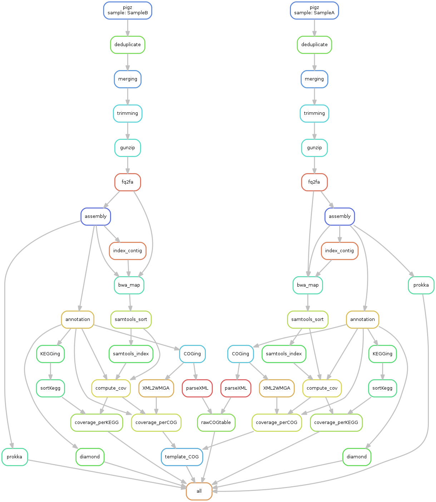

# Metagenomics pipeline

This step was developed with the workflow management **Snakemake** (see the DAG below). 
The pipeline and all software dependencies were packed in a **Docker immage**. 
The only prerequisite for using this pipeline is to install the docker on your machine.


## 1) Get the path of the following databases (or download them if they are missing)  

Check the presence of 3 databases or install them

### COG databases (rps-balst): 
Download from: 
ftp://ftp.ncbi.nlm.nih.gov/pub/mmdb/cdd/little_endian/Cog_LE.tar.gz

### nr.dmnd (DIAMOND)
See documentation https://github.com/bbuchfink/diamond , and used version 0.8.36
Briefly, we assume to have a protein database file in FASTA format named nr.faa
```bash
diamond makedb --in nr.faa -d nr
```

### KEGGpep (DIAMOND)

Likewise, we assume to have a file in FASTA format named KEGGpep.faa
```bash
diamond makedb --in KEGGpep.faa -d nr
```

## 2) Format your data
This metagenomic pipeline will process overlapping paired-end raw reads. 
Raw files need to be format as below:

```
*_1.fastq.gz 
*_2.fastq.gz
```

All libraries can be gathered in a same directory, here called *data*

## 3) Processing of raw metagenomics reads

To execute this pipeline with your own data you need to: 
1. build the Docker image
```bash
docker build -t pipeline-metag .
```

2. run the Docker image, mounting your db and data directories using the volume flag
```bash
docker run -v /path/to/db/Cog_LE/:/root/databases/COG/Cog_LE/ \
           -v /path/to/db/nr.dmnd:/root/databases/DIAMOND/nr.dmnd  \
           [-v /path/to/db/diamond_KEGGpep.dmnd:/root/databases/Kegg/diamond_KEGGpep.dmnd] \
           -v /path/to/your/data/:/root/Data/ \
           -it pipeline-metag 
```

3. run Snakemake pipeline
```bash
cd /root
snakemake --cores 8 --resources ram=10
```
    * *--cores*: corresponds to the number of cores to use and 
    * *--resources*: define ram as an additional resources to constrain the scheduling if you are RAM-limited (required if your RAM < 256 Go )




